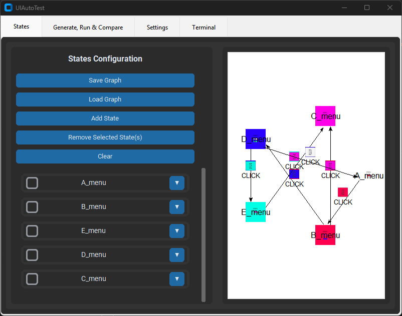

# UIAutoTest

> Authors:  
> Paula Alemany Rodríguez  
> Pablo Iglesias Rodrigo  
> Andrés García Navarro  
> Cristina Mora Velasco  
> Francisco Miguel Galván Muñoz  
> Yi (Laura) Wang Qiu  

UIAutoTest is a tool designed to verify the correct functioning of user menus using [Sikulix](https://sikulix.github.io/docs/) and python scripts. The main objective is to compare the navigation flow provided by the user with the actual flow obtained by automatically interacting with the executable. This comparison allows detecting functional errors without the need for repetitive manual testing each time a new version of the executable is generated.
Both flows are represented by non-valued directed graphs, where each vertex represents a menu or screen and each edge represents a possible transition between menus, activated by an interface element (such as a button) and its corresponding input.

The theoretical flow is defined by means of a .txt or graphical interface where the expected navigation structure is described (menus that appear, buttons contained in menus and what is their visual representation). At the same time the game is executed to obtain the real flow by generating the corresponding graph.

The tool compares both graphs to identify differences between expected and actual behavior. It also includes a battery of additional tests that detect common problems such as unconnected nodes, auto edges, buttons that lead to an unidentifiable state or interface elements that do not appear or do not work. The tests included are: prime path coverage, autoedge coverage, edge pair coverage and full connectivity.
The result of the analysis is presented in a .txt file and by means of a graphical interface that shows differences and the results of each test.



## Prerequisites

> [!IMPORTANT]
> Sikulix needs the whole machine: mouse cursor, keyboard and an unlocked screen for test automatization. Do not expect to use your PC in the usual way.

As stated in the [Sikulix's official documentation](https://sikulix.github.io/docs/start/installation), you will need:

- Windows, macOS or Linux
- Java 8+ installed
- All 64-bit version

For this project, it will be developed and only tested for Windows systems. Please read the documentation from the web above for more information.

Additionally, [Python](https://www.python.org/downloads/) will be used as the scripting language to interact with the Sikulix API.

### Other aspects

> [!NOTE]
> All the images must have sufficient quality to be clicked and displayed in the executable large enough. Image captures should be taken from the machine where it will run the tests.

> [!NOTE]
> Screen resolution must be on 100% without scaling.

### Download Sikulix API and Jython

```py
python downloadDependencies.py
```

### Install Python packages requirements

```cmd
pip install -r requirements.txt
```

## Try it

```ps
python UIAutoTest.py <config.json>
```

If `config.json` is passed as an argument, it will not create an interface.

The variables in `config.json` are the following:

- `java_path`: Path to java, if added to environment variables: `java`.
- `sikulix_jar`: Path to jython.jar, it is also downloaded by it executing [downloadDependencies.py](downloadDependencies.py), it is set to `sikulixapi-2.0.5.jar` by default.
- `images_dir`: Path to used images to generate the graph, it is set to `bin\sample_images` by default.
- `tests_dir`: Path to designed tests to study the generated graph, it is set to `tests` by default.
- `theorical_graph_file`: Name of the theorical graph (the graph which represents how it should be the menu flow), it is set to `graph.txt` by default. You can create the file by hand using the interface we provide by executing [UIAutoTest.py](UIAutoTest.py).
- `practical_graph_file`: Name of the graph generated by the automated framework, it is set to `output_graph.txt` by default.
- `generate_graph`: Set to `true` by default to generate graph, do the tests if defined in `tests_to_run` and compare `theorical_graph_file` with `practical_graph_file`. If set to `false`, it makes the tests if defined and compares.
- `selected_executable`: path to executable, it is set to `bin/Sample/My project.exe` by default to try the example.
- `executable_delay`: Time in seconds to determine that executable has started to be evaluated by automation, it is set to `5` by default.
- `debug_images`: (flag) If present during the generation of the graph, screen captures and detected input image regions will be saved.
- `timeout`: time in seconds that Sikulix will wait to find the image on screen.
- `initial_similarity`: the initial similarity value (from 0 to 1) used to start searching for images on the screen with Sikulix. A value of 1 means an exact match is required; 0 means no similarity is required.
- `min_similarity`: The minimum similarity value (from 0 to 1) allowed when searching for images on the screen with Sikulix. If no image is found with the initial similarity, the search will continue decreasing the similarity down to this minimum value.
- `similarity_step`: The amount by which the similarity value is decreased in each step when searching for images on the screen. The search starts at `initial_similarity` and decreases by this value until reaching `min_similarity`.
- `retries`: The number of retries to check images.
- `state_reset_method`: It can be any of the following:
  - "none": No action taken when restarting executable
  - "copy_reset": Copy the original executable and surrounding files to a temporary directory to make generate the graph each time it relaunches.
  - "external_reset": Executes an user's script that should ensure the resetting of the executable (e.g. removing saved files by the executable).
- `external_reset_script`: Script that should be run to reset the state of the executable when iterating and needs to rerun to continue generating the graph.
- `tests_to_run`: Lists of tests to run, the names of the tests classes must be given and should be located in `tests_dir`, we provide the following tests: [`EdgePairCovTest`, `PrimePathCovTest`, `SelfLoopTest`, `TotalConnectTest`].
- `pdf_file`: Name of the final report file in PDF, it is set to `report.pdf` by default.
- `solution_file`: Name of the final report file, it is set to `solution.txt` by default.
